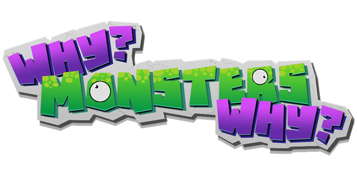

# Why, Monsters ? Why?

Do you have free time? Or not, but you keep procrastinating about what you should do? STOP THERE! Join us and play this absurd but sensational, 
2-player local fighting game where you have to survive an epic fight between cute but really, really goofy monsters!

This is a game (demo/protoype/vertical slice) developed by students from <a href="https://www.imagecampus.edu.ar/">Image Campus</a>

   

## Credits

- **Cristian Cusumano** - *Programming* -   <a href="LINK A RED">  
- **Agustina Montini Tesorero** - *Art* -     
- **Lautaro Garcia Mollard** - *Art* -     
- **Lucia Criscuolo** - *Art* -     
- **Tomas Rubianes** - *Art* -     
- **Delboni Fabricio** - *Audio* -     
- **Ingercher Casas Alejandro** - *Audio* -     
- **Leandro Feer** - *Testing* -     
- **Ivan Fernandez** - *Testing* -     
- **Tomas Pereyra** - *Testing* -     
- **Fernando Puig** - *Testing* -     
- **Nahuel Retamoso** - *Testing* -     

This game was also possible thanks to the support of these professors:

- **Sergio Baretto**
- **Federico Barra**
- **Jorge Cuéllar**
- **Fernando Puig**
- **Eugenio Taboada**

## Links

Download it from itch.io: https://cusumdt.itch.io/whymonsterswhy
